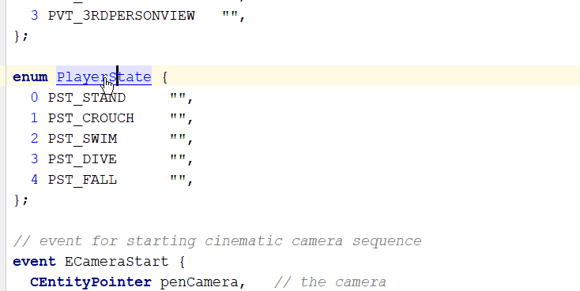

# Serious Engine .es File Integration 4 the IntelliJ Platform

This is an unofficial plugin for IntelliJ based products that provide an easier way to edit .es files

**Warning: this is a sandbox project, it does not pretend to work and it can be discontinued at any time**

## Features
**Syntax highlighting**

**Code References**

**Find Usages**

**Go To Class**

## Installing
1. [Download](https://github.com/aarcangeli/ES-intellij-plugin/releases/tag/v0.0.1) latest binary distribution
1. Open File->Settings->Plugins->Install Plugin From Disk
1. Restart

### Known issues
  - Method body expression's are not fully parsed
  - Code completion at 80% suggests non-compiling code
  - Psi reference does not resolve c++ references
